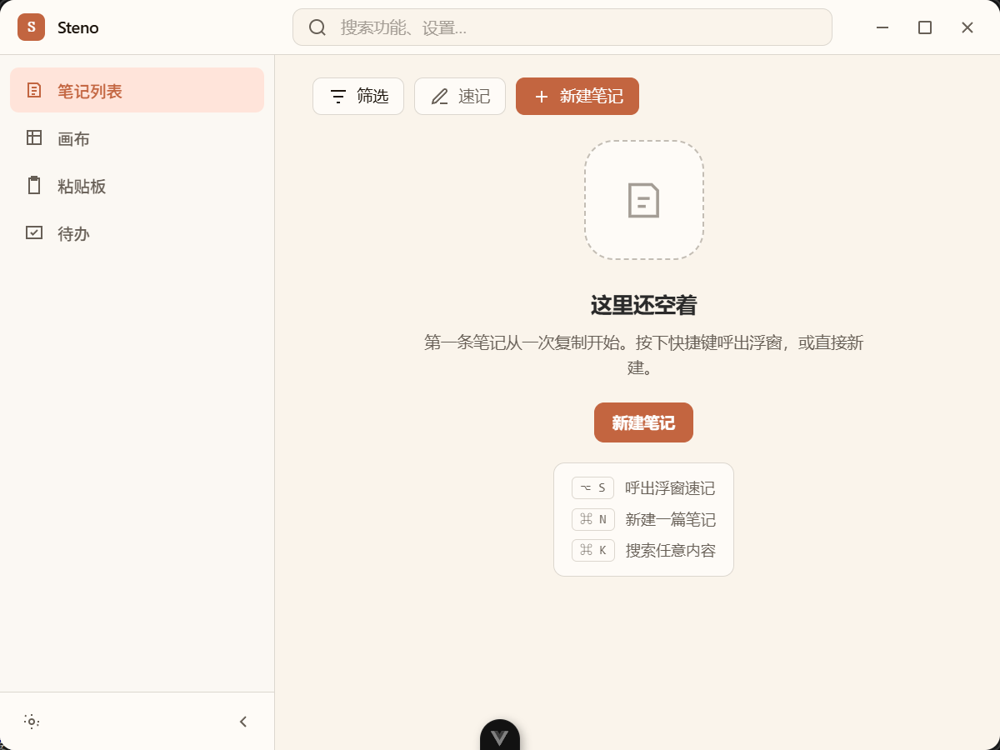
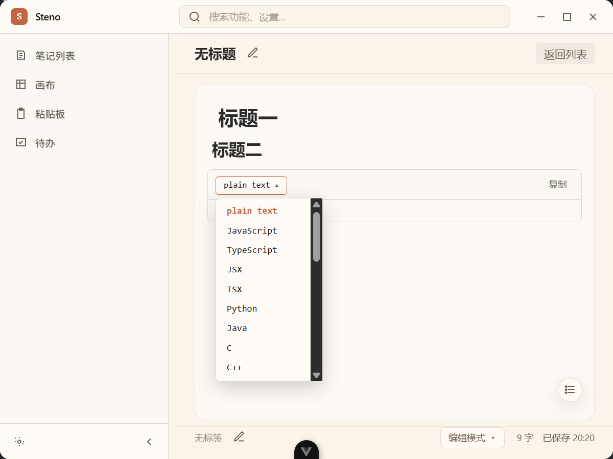
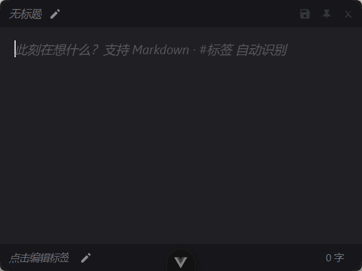
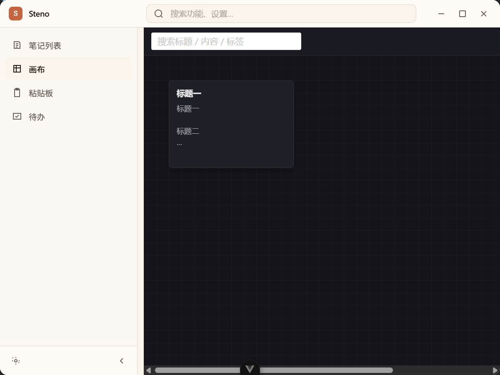
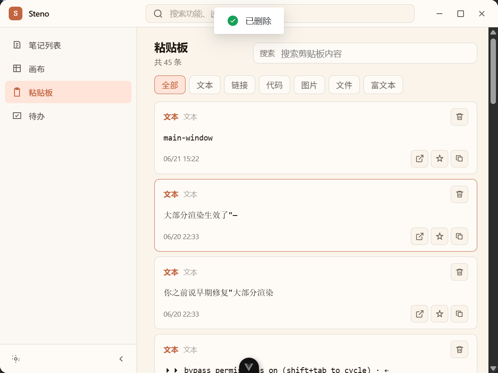
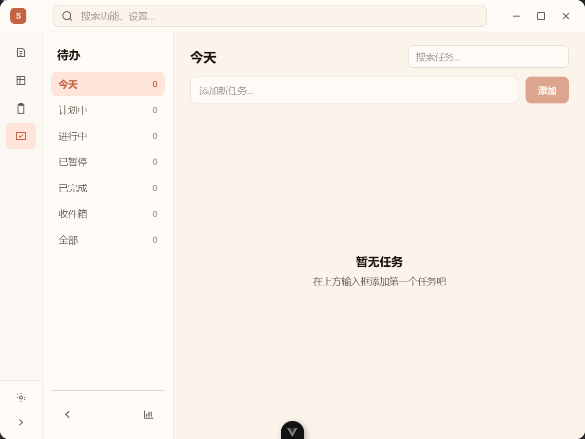
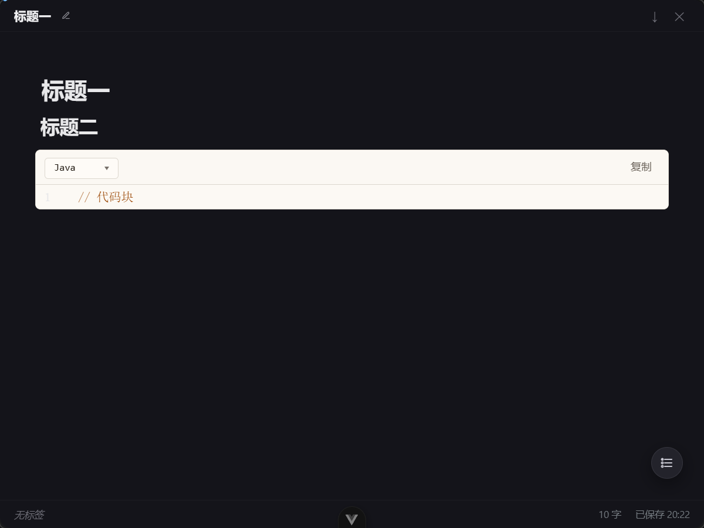
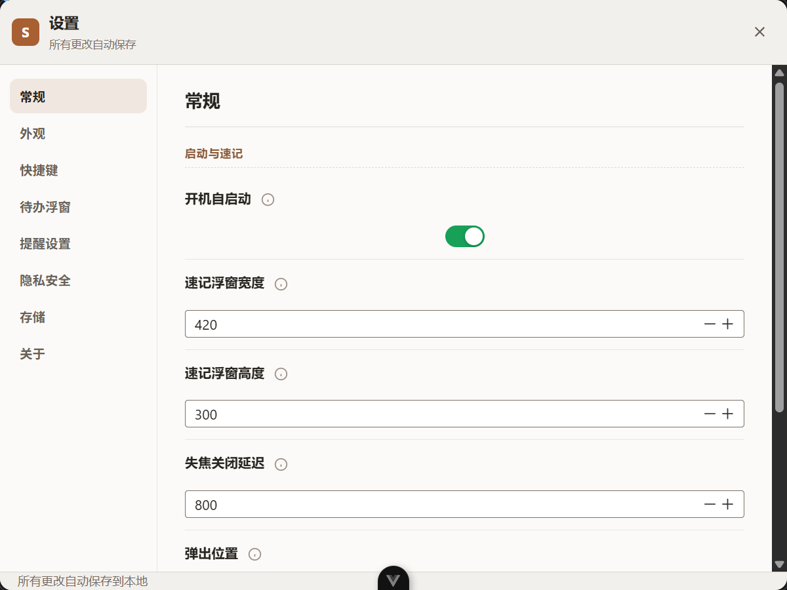

<p align="center">
  
</p>

<h1 align="center">Steno · 速记</h1>

<p align="center">
  <strong>A local-first desktop quick-note and Markdown workbench</strong><br />
  Built with Tauri 2, Rust, and Vue 3. Capture fast, organize later, your data stays on your machine.
</p>

<p align="center">
  
  
  
  
  
</p>

<p align="center">
  <a href="#overview">Overview</a> ·
  <a href="#features">Features</a> ·
  <a href="#screenshots">Screenshots</a> ·
  <a href="#quick-start">Quick Start</a> ·
  <a href="#tech-stack">Tech Stack</a> ·
  <a href="#project-structure">Project Structure</a>
</p>

<p align="center">
  <a href="./README.md">中文</a>
</p>

---

## Overview

Steno is a local-first quick-note app built for desktop workflows. It isn't about "how to write a polished document" — it's about "the moment a thought appears, how to capture it without switching apps."

Press a global shortcut and the quick-note window appears on top of whatever you're using. Your text auto-saves as a local draft, and you can keep organizing it later in the main window, on the infinite canvas, or in Zen mode — then export to Markdown or HTML.

Core principles:

- **Capture first** — write it down now, decide where it belongs later.
- **Local first** — notes, todos, and clipboard content are never uploaded by default.
- **Markdown first** — the editing experience feels close to WYSIWYG, while the underlying storage stays plain Markdown text.
- **Desktop first** — tray, global shortcuts, pinned stickies, system notifications, and local folder workspaces are all first-class capabilities.

---

## Features

| Module | What it does today |
| --- | --- |
| Quick Capture | Tray-resident, main-window shortcut, quick-note window, auto-saved drafts, `#tag` recognition |
| Pinned Stickies | Pin notes to the desktop; multiple at once; adjustable size, position, opacity, color, and font size |
| Main Workbench | Custom titlebar, collapsible sidebar, command search, note list, tag filtering, right-click menu |
| Markdown Writing | ProseMirror Typora-style editor, read-only preview, outline jump, Zen mode, paste-image into library |
| Infinite Canvas | Free card dragging, wheel zoom, viewport panning, search and tag filtering, double-click into Zen writing |
| Local Workspaces | Create a workspace from a local folder, scan `.md`, `.markdown`, `.txt`; text entries can be converted into workspace documents |
| Todos | Main-window todo management, today's-todo floating panel, status flow, due dates, quick reminders, system notifications |
| Stats | Todo activity heatmap, created/started/completed trend charts, range and status filters |
| Clipboard | Text, link, code, image, file, and rich-text history with search, filter, pin, copy, paste, and image editing |
| Export | Markdown export with YAML frontmatter; local images can be bundled with the Markdown; HTML exports as a standalone file; PDF via the print window |
| Settings | Theme, language, shortcuts, floating-window position, reminder options, retention days, data path, launch-at-startup |

Default shortcuts:

| Shortcut | Action |
| --- | --- |
| `Ctrl+Shift+N` | Toggle or hide the main window |
| `Ctrl+Shift+M` | Summon the quick-note window |
| `Ctrl+Shift+V` | Open the clipboard |
| `Ctrl+Shift+T` | Summon today's-todo floating panel |
| `Ctrl+Shift+F` | Global command search |

Shortcuts can be changed in the settings panel. The current shortcut parser mainly covers `Ctrl`/`Shift`/`Alt` plus a single letter key.

---

## Screenshots

> The screenshots below live in [`docs/screenshots/`](./docs/screenshots/); the capture guidelines and per-shot checklist are in that directory's [README](./docs/screenshots/README.md).

### Main Window

A unified desktop workbench that brings notes, canvas, clipboard, todos, and stats together.

<p align="center">
  
</p>

### Markdown Editor

A ProseMirror-powered, Typora-style editor — WYSIWYG on the surface, plain Markdown text underneath.

<p align="center">
  
</p>

### Quick-Note Window

Capture on top of any app; auto-saves as a draft once you stop typing.

<p align="center">
  
</p>

### Infinite Canvas

Organize notes as spatial cards — great for shaping ideas, meeting notes, and project threads.

<p align="center">
  
</p>

### Clipboard

A unified history of text, links, code, images, and files — searchable, filterable, pinnable, with one-click re-paste.

<p align="center">
  
</p>

### Todos

Manage tasks centrally in the main window; the today's-todo panel stays on the desktop with status flow, due dates, and reminders.

<p align="center">
  
</p>

### Zen Mode

A fullscreen writing view that keeps the outline and basic export entry points.

<p align="center">
  
</p>

### Settings Panel

Centralized control over theme, shortcuts, floating windows, reminders, privacy boundaries, and the local storage path.

<p align="center">
  
</p>

---

## Quick Start

### Prerequisites

| Dependency | Version |
| --- | --- |
| Node.js | `>= 20.19.0` |
| pnpm | `>= 10.5.0`, repo pins `pnpm@11.5.0` |
| Rust | Per `src-tauri/Cargo.toml`, uses edition 2024 (Rust `>= 1.85` recommended) |

Platform dependencies:

- **Windows**: MSVC C++ Build Tools, the Windows 10/11 SDK, and the WebView2 Runtime.
- **macOS**: Xcode Command Line Tools.
- **Linux**: install WebKitGTK and related packages per the [official Tauri 2 prerequisites](https://v2.tauri.app/start/prerequisites/#linux).

### Install and develop

```bash
pnpm install
pnpm tauri:dev
```

Run only the frontend dev server:

```bash
pnpm dev
```

Vite runs at `http://localhost:21420` by default, and Tauri dev mode uses that address automatically.

### Build

```bash
pnpm tauri:build
```

Production bundles are written to `src-tauri/target/release/bundle/`.

### Quality checks

```bash
pnpm typecheck            # vue-tsc type checking
pnpm test                 # Vitest frontend unit tests
pnpm lint                 # oxlint + eslint
pnpm fmt                  # oxfmt formatting
cd src-tauri && cargo test    # Rust unit tests
cd src-tauri && cargo check   # Rust type checking
```

---

## Tech Stack

| Layer | Tech |
| --- | --- |
| Desktop Shell | Tauri 2 |
| Backend | Rust 2024, tokio, rusqlite, arboard, walkdir, pulldown-cmark |
| Frontend | Vue 3, TypeScript, Vite 7, Pinia |
| UI | Naive UI, UnoCSS, app-level CSS-variable theming |
| Editor | ProseMirror Markdown core, with CodeMirror 6 embedded in code blocks |
| Markdown Rendering | markdown-it, Shiki, KaTeX, Mermaid, DOMPurify |
| Charts | ECharts, vue-echarts |
| i18n | vue-i18n, with built-in Simplified Chinese, Traditional Chinese, English, Japanese, Korean, French, and German |
| Tooling | pnpm, Vitest, oxlint, eslint, oxfmt, simple-git-hooks |

Editor notes:

- `src/components/MarkdownEditor.vue` is the current general-purpose editing entry point.
- `src/components/markdown-editor/` is the in-house Markdown WYSIWYG core (schema, parser, serializer, nodeviews, plugins).
- Data is still written as Markdown strings; the editing and read-only states share the same schema and serialization logic.

---

## Data Directory

Steno writes user data to `~/.steno/` by default.

| Path | Description |
| --- | --- |
| `~/.steno/data.db` | SQLite database holding notes, settings, clipboard, the workspace index, and todos |
| `~/.steno/images/` | Local images pasted into the Markdown editor |
| `~/.steno/backup/` | Database backup files |
| `~/.steno/exports/` | Markdown, HTML, and bundled-Markdown-with-images exports |
| `~/.steno/data/logs/` | Runtime logs, stored in per-date folders and rotated once a file hits its size threshold |

Full paths can be viewed and copied under the "Storage" area of the settings panel.

---

## Project Structure

```text
steno/
├── src/                              # Vue 3 frontend
│   ├── App.vue                       # Dispatches views by window label and route mode
│   ├── main.ts                       # Frontend entry
│   ├── components/
│   │   ├── MainWorkbenchShell.vue    # Main-window shell
│   │   ├── FloatingEditor.vue        # Quick-note window and pinned stickies
│   │   ├── MarkdownEditor.vue        # ProseMirror Markdown editor entry
│   │   ├── MarkdownReadSurface.vue   # Read-only Markdown render panel
│   │   ├── Canvas.vue                # Infinite canvas core
│   │   ├── DocumentOutlineTree.vue   # Document outline tree
│   │   ├── WorkspaceTreePanel.vue    # Workspace file tree
│   │   ├── clipboard/                # Clipboard image editing and related components
│   │   ├── writing/                  # Writing-mode related components
│   │   └── markdown-editor/          # ProseMirror core
│   ├── views/
│   │   ├── MainView.vue              # Note list
│   │   ├── NoteEditorView.vue        # In-window note editing
│   │   ├── CanvasView.vue            # Canvas page
│   │   ├── ClipboardView.vue         # Clipboard history
│   │   ├── TodoView.vue              # Todo management
│   │   ├── TodoQuickPanel.vue        # Today's-todo floating panel
│   │   ├── StatsView.vue             # Todo stats
│   │   ├── ZenMode.vue               # Zen writing
│   │   ├── SettingsView.vue          # Settings panel
│   │   └── PrintView.vue             # Print and save-as-PDF window
│   ├── stores/                       # Pinia stores
│   ├── composables/                  # Vue composition functions
│   ├── utils/                        # Markdown, image, preview, and other utilities
│   ├── i18n/                         # Localization strings (zh-CN/zh-TW/en/ja/ko/fr/de)
│   ├── theme/                        # Theme and app-level CSS variables
│   ├── styles/                       # Global styles and Markdown render styles
│   ├── plugins/                      # Frontend plugin registration
│   └── types/steno.ts                # Frontend IPC DTO mirror
│
├── src-tauri/                        # Rust backend (layered architecture)
│   ├── src/
│   │   ├── lib.rs                    # Tauri Builder and plugin registration
│   │   ├── main.rs                   # Executable entry
│   │   ├── app/                      # Window and system integration
│   │   │   ├── window_manager.rs     # Multi-window management
│   │   │   ├── quicknote.rs          # Quick-note window
│   │   │   ├── shortcut.rs           # Global shortcuts
│   │   │   ├── tray.rs               # System tray
│   │   │   └── logging.rs            # File logging
│   │   ├── ipc/commands.rs           # IPC command boundary
│   │   ├── domain/                   # Domain models
│   │   │   ├── models.rs             # Note and other DTOs
│   │   │   ├── clipboard.rs          # Clipboard models
│   │   │   └── todo.rs               # Todo models
│   │   ├── data/                     # Persistence and local data
│   │   │   ├── db.rs                 # SQLite schema, migrations, and data access
│   │   │   ├── backup.rs             # Database backup
│   │   │   ├── cleanup_scheduler.rs  # Draft and clipboard cleanup
│   │   │   ├── workspace_fs.rs       # Local workspace scanning and writing
│   │   │   └── sync.rs               # Cloud-sync trait and boundary (not yet implemented)
│   │   └── services/                 # Background services
│   │       ├── export.rs             # Markdown and HTML export
│   │       └── reminder_scheduler.rs # Due-reminder scheduler
│   ├── Cargo.toml
│   └── tauri.conf.json
│
├── docs/screenshots/                 # README screenshots and capture checklist
├── public/                           # Static assets
├── build/                            # Vite plugins and build config
└── scripts/                          # Project scripts
```

---

## Current Status and Boundaries

Shipped:

- Tray, main window, quick-note window, pinned stickies, and multi-window management.
- Note list, Markdown editing, read-only preview, Zen mode, infinite canvas.
- Clipboard history, todo management, today's-todo floating panel, reminders, and stats.
- Local workspace scanning and converting text entries into Markdown documents.
- Markdown and HTML export, with bundled-image export.
- Language, theme, shortcut, and storage-path settings.

Still planned or limited:

- Screenshot, OCR, and translation currently have only routing and placeholder capabilities.
- SQLCipher database encryption, sensitive-content filtering, and an app exclusion list are still roadmap items in the settings panel.
- Cloud sync keeps only the trait and boundary design (`src-tauri/src/data/sync.rs`); there is no actual sync implementation yet.
- Silent PDF file generation has no cross-platform adapter; for now the print window lets users save as PDF.

---

## Related Documentation

- [Contributing Guide](./CONTRIBUTING.md)
- [Screenshot checklist and capture guidelines](./docs/screenshots/README.md)
- [中文 README](./README.md)

---

## Support

If Steno helps your workflow, consider buying the developer a coffee.

<p align="center">
  <table align="center">
    <tr>
      <td align="center" width="50%">
        <br />
        <strong>WeChat</strong>
      </td>
      <td align="center" width="50%">
        <br />
        <strong>Alipay</strong>
      </td>
    </tr>
  </table>
</p>

---

## License

MIT. The authoritative license declaration is in [package.json](./package.json).
